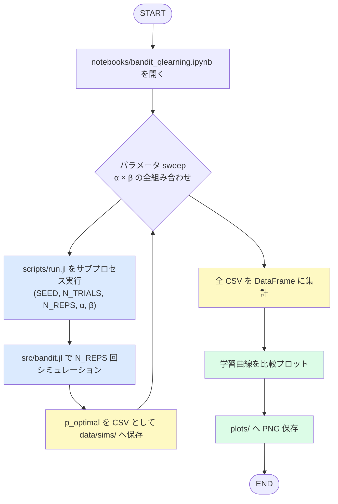
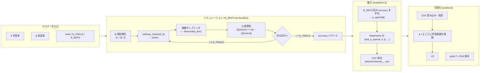

# BanditTutorial

[Julia](https://julialang.org/) と [DrWatson](https://juliadynamics.github.io/DrWatson.jl/stable/) を使った多腕バンディットQ学習のチュートリアルプロジェクト。

作者: Kura

---

## 概要

2本腕バンディット課題上でQ学習エージェントを動かし、学習率α・逆温度βのパラメーターsweepによる学習曲線と累積regretの変化を可視化する。

- 報酬確率: アーム1 = 0.2、アーム2 = **0.8**（固定）
- 行動選択: softmax（逆温度 β）
- Q値更新: δ則（`Q ← Q + α(r − Q)`）
- 評価指標: 最適腕選択率 `p_optimal` と累積後悔 `cumulative regret`

---

## ワークフロー図



---

## データフロー図



---

## ファイル構成

```
BanditTutorial/
├── notebooks/
│   └── bandit_qlearning.ipynb   # メイン。パラメータ sweep → 集計 → 作図
├── scripts/
│   └── run.jl                   # 1 条件をシミュレーションして CSV 保存
├── src/
│   ├── bandit.jl                # モデル: softmax_choice / run_bandit
│   └── io.jl                    # 保存: save_sim（CSV 書き出し）
├── test/
│   └── runtests.jl              # ユニットテスト
├── data/
│   └── sims/                    # 生成された CSV（git 管理外）
└── plots/                       # 生成された図（git 管理外）
```

### 主要ファイルの役割

| ファイル | 役割 |
|---|---|
| [`notebooks/bandit_qlearning.ipynb`](notebooks/bandit_qlearning.ipynb) | sweep 定義・集計・作図のメイン |
| [`scripts/run.jl`](scripts/run.jl) | 1パラメーター条件のシミュレーション実行（`bandit.jl` + `io.jl` を呼ぶ） |
| [`src/bandit.jl`](src/bandit.jl) | モデル: `softmax_choice` / `run_bandit` |
| [`src/io.jl`](src/io.jl) | 保存: `save_sim`（DataFrame 構築〜CSV 書き出し） |
| [`test/runtests.jl`](test/runtests.jl) | 各関数のユニットテスト |

---

## セットアップ

```julia
# 1. DrWatson をグローバルにインストール
julia> using Pkg
julia> Pkg.add("DrWatson")

# 2. プロジェクトを有効化してパッケージを揃える
julia> Pkg.activate("path/to/BanditTutorial")
julia> Pkg.instantiate()
```

### notebook の起動

```julia
julia> using IJulia; notebook(dir="notebooks")
```

Juliaカーネルは **`julia-1.11`** を選択する。

### スクリプト単体実行

```bash
julia scripts/run.jl SEED N_TRIALS N_REPS ALPHA BETA P1 P2 [P3 ...]
# 例: julia scripts/run.jl 42 100 200 0.3 5.0 0.2 0.8
```

引数を省略した場合は使い方のメッセージが表示される。

### テスト実行

```bash
julia --project=. test/runtests.jl
```

---

## パラメーター

| 引数 | 型 | 説明 |
|---|---|---|
| `SEED` | Int | 乱数シード |
| `N_TRIALS` | Int | 1 回のシミュレーションの試行数 |
| `N_REPS` | Int | 反復回数（平均化用） |
| `ALPHA` (α) | Float64 | Q 学習の学習率（0〜1） |
| `BETA` (β) | Float64 | softmax の逆温度 |
| `P1 P2 ...` | Float64... | 各腕の報酬確率（2 本以上、スペース区切り） |

---

## CI

GitHub ActionsでJulia 1.11 / ubuntu-latest / x64による自動テストを実行している（`.github/workflows/CI.yml`）。
`main`へのプッシュおよびPull Requestでトリガーされる。
